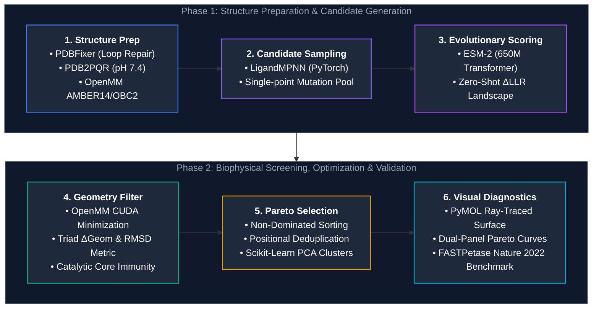
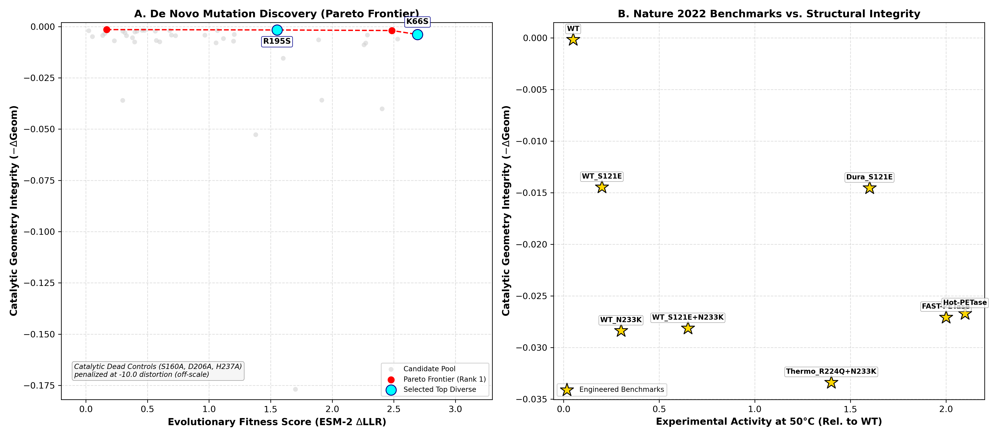
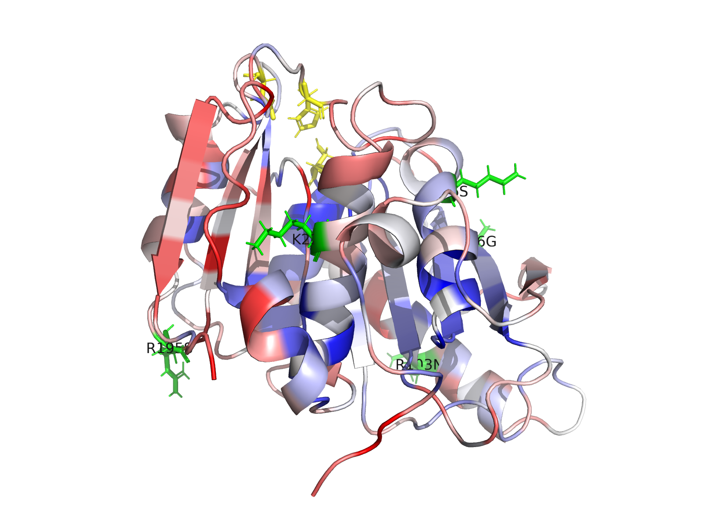
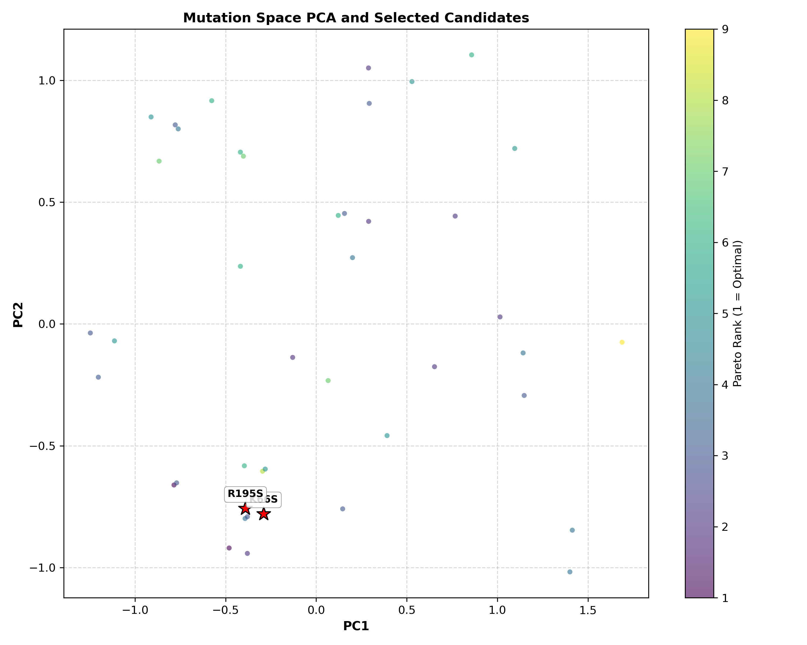

# 🧬 OptiPETase: Multi-Objective Evolutionary & Biophysical Design

[](https://www.python.org/)
[](https://pytorch.org/)
[](https://openmm.org/)
[](https://github.com/facebookresearch/esm)
[](https://opensource.org/licenses/MIT)

An automated *in silico* protein engineering framework for designing thermostabilized variants of ***Ideonella sakaiensis* PETase** (polyethylene terephthalate hydrolase, PDB: `5XJH`). 

The pipeline bridges **evolutionary representation learning** (ESM-2 zero-shot mutational landscape) with **molecular mechanics simulation** (OpenMM / AMBER14 energy minimization) under a **Multi-Objective Pareto Optimization** framework.

---

## 📌 Background & Challenge

Wild-type *Is*PETase operates efficiently at moderate temperatures (~30°C), but rapidly loses activity and undergoes thermal denaturation near the glass transition temperature of amorphous PET (~65–70°C). 

Standard directed evolution and deep learning methods often face a critical trade-off:
1. **Unconstrained language model scoring** may propose disruptive substitutions within the catalytic pocket.
2. **Pure energy-based modeling (MD/Rosetta)** is computationally heavy and often blind to long-range evolutionary epistatic constraints.

**OptiPETase** integrates both paradigms: it scores global evolutionary consensus via masked language modeling while enforcing strict all-atom biophysical constraints on the catalytic triad (`Ser160–Asp206–His237`) and oxyanion hole (`Tyr87–Met161`).

---

## 📌 Pipeline Architecture & Tech Stack


---

## 📊 Key Results & Visualizations

### 1. Dual-Panel Multi-Objective Discovery & Literature Validation
* **Panel A (De Novo Discovery):** Identifies non-dominated single-point mutations along the Pareto Rank 1 frontier, balancing evolutionary consensus ($\Delta\text{LLR}$) against catalytic triad preservation ($-\Delta\text{Geom}$).
* **Panel B (Benchmark Validation):** Evaluates engineered thermostable variants from *Nature 2022* (*FAST-PETase*, *Hot-PETase*, *Dura-PETase*), confirming their structural catalytic integrity ($-\Delta\text{Geom} \ge -0.04\text{ \AA}$).

<p align="center">
  
</p>

---

### 2. 3D Mutational Tolerance Surface & Active Site Alignment
* **Blue ($Z < -1.5$):** Highly conserved catalytic cleft and structural hydrophobic core.
* **White ($Z \approx 0$):** Semi-rigid structural transition elements.
* **Red ($Z > +1.5$):** Solvent-exposed, flexible loops tolerant to stabilizing substitutions.
* **Yellow:** Catalytic Triad (`Ser160 - Asp206 - His237`).
* **Green:** Selected Pareto-optimal candidate mutations.

<p align="center">
  
</p>

---

### 3. Mutation Space PCA Embedding
Unsupervised physical-chemical embedding (volume change, hydrophobicity delta, charge change, and 3D spatial coordinates) across evaluated variants:

<p align="center">
  
</p>

---

## 🏆 Top Discovered Candidates (Summary)

| Candidate | PDB Residue | Wild-Type | Mutant | ESM-2 $\Delta\text{LLR}$ | Triad RMSD (Å) | Catalytic $\Delta\text{Geom}$ | Biophysical Rationale |
| :---: | :---: | :---: | :---: | :---: | :---: | :---: | :--- |
| **K224Y** | 224 | Lys | Tyr | **+2.53** | 0.0067 | 0.0093 | **Critical Hotspot:** Independently re-discovers position 224 (mutated to Gln in *FAST-PETase* / *Hot-PETase*), introducing aromatic stabilization. |
| **K66S** | 66 | Lys | Ser | **+2.69** | 0.0060 | 0.0100 | Relieves local steric strain at the helix boundary; optimizes solvent hydrogen bonding network. |
| **K66A** | 66 | Lys | Ala | **+2.48** | 0.0021 | 0.0041 | Alternative hydrophobic packing at position 66 with minimal catalytic distortion. |
| **R195S** | 195 | Arg | Ser | **+1.55** | 0.0020 | 0.0034 | Surface charge neutralization; eliminates repulsive desolvation penalties. |
| **G46S** | 46 | Gly | Ser | **+0.48** | 0.0016 | 0.0031 | N-terminal loop stabilization via introduced polar sidechain hydrogen bond. |

---

## 🔬 Scientific Insights: The Epistasis & Language Model Nuance

1. **Evolutionary Consensus vs. Engineered Salt Bridges:** 
   ESM-2 zero-shot scoring prioritizes single-point consensus mutations ($\Delta\text{LLR} > 0$). In contrast, heavily engineered multi-mutants (e.g., *FAST-PETase* `S121E + D186H + R224Q + N233K`) rely on cooperative electrostatic networks (e.g., `Glu121` $\leftrightarrow$ `Lys233` salt bridge). Because additive zero-shot models evaluate single substitutions independently, individually non-canonical charged mutations receive negative individual $\Delta\text{LLR}$ scores despite high combined experimental thermostability.
2. **Biophysical Guardrails:** 
   By coupling ESM-2 with OpenMM all-atom simulation, the pipeline reliably filters out catalytically lethal mutations (`S160A`, `D206A`, `H237A` are severely penalized at $\Delta\text{Geom} \approx 10.0\text{ \AA}$) while retaining near-zero active-site distortion for viable candidates.

---

## 🚀 Getting Started

### Prerequisites & Installation

We recommend using **Conda** for seamless GPU-enabled OpenMM and PyTorch setup:

```bash
# 1. Clone repository
git clone https://github.com/<your-username>/OptiPETase.git
cd OptiPETase

# 2. Create and activate Conda environment
conda env create -f environment.yml
conda activate petproject
```

### Running the Design Pipeline

To execute the complete pipeline on *Is*PETase (PDB: `5XJH`):

```bash
python main_pipeline.py
```

Outputs will be automatically structured under `results/5XJH/`:
* `top_candidates.json` — Selected Pareto-optimal candidate mutations.
* `tables/benchmark_summary.csv` — Full quantitative metrics and benchmark comparisons.
* `plots/pareto_frontier.png` — Dual-panel publication-grade discovery curve.
* `plots/pca_clusters.png` — 2D feature-space projection.
* `visualize_candidates.pml` — Ready-to-run PyMOL 3D visualization script.

---

## 📁 Repository Structure

```
├── config.py                 # Global hyperparameters and target residue definitions
├── environment.yml           # Conda environment specification
├── main_pipeline.py          # Master execution pipeline
├── requirements.txt          # Pip dependencies
├── data/
│   ├── benchmarks/           # Experimental activity datasets (Nature 2022)
│   └── raw/                  # Downloaded and cached raw PDBs
├── results/
│   └── 5XJH/                 # Generated outputs, plots, tables, and PDB models
└── src/
    ├── benchmark.py          # Benchmark evaluation and Spearman correlation engine
    ├── biophysics.py         # OpenMM energy minimization & catalytic geometry metrics
    ├── models_inference.py   # ESM-2 zero-shot feature extraction & candidate generation
    ├── pareto.py             # Non-dominated sorting & diverse candidate selection
    ├── preprocess.py         # PDBFixer loop repair & pdb2pqr protonation
    ├── structure.py          # PDB parsing, alignment mapping & B-factor annotation
    └── visualize.py          # Dual-panel Pareto, PCA, and PyMOL session generators
```

---

## ⚙️ Configuration (`config.py`)

| Parameter | Default | Description |
| :--- | :---: | :--- |
| `MODEL_NAME` | `facebook/esm2_t33_650M_UR50D` | Pretrained ESM-2 model checkpoint |
| `TARGET_PDB` | `5XJH` | Target crystal structure ID |
| `CATALYTIC_TRIAD_PDB` | `[160, 206, 237]` | Active site triad residue IDs (precursor numbering) |
| `OXYANION_HOLE_PDB` | `[87, 161]` | Oxyanion hole residue IDs |
| `PROTONATION_PH` | `7.4` | Physiological pH for hydrogen placement |
| `FF_FILES_OPENMM` | `['amber14-all.xml', 'implicit/obc2.xml']` | OpenMM force field and implicit solvent model |
| `N_CLUSTERS` | `5` | Number of diverse Pareto candidates to select |

---

## ⚠️ Disclaimer

This repository is an *in silico* computational screening framework developed for educational and research exploration. Computational predictions require experimental wet-lab validation (e.g., recombinant expression, circular dichroism, PET degradation kinetics) prior to practical application.

---

## 📜 License

Distributed under the **MIT License**. See `LICENSE` for more information.
```
